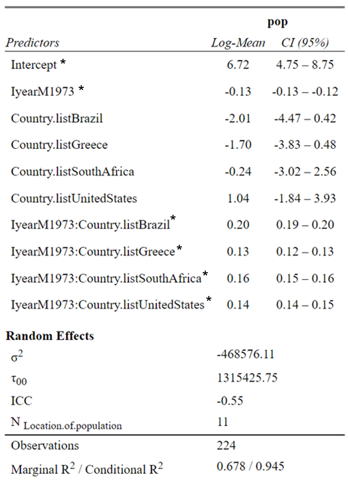

## Loggerhead Sea Turtle *(Caretta Caretta)* Population Trends - comparing population trends in different countries


### Background    
Understanding population trends of species is important to assess whether current management strategies are working or a revised conservation strategy is necessary (Ceriani, 2019). This study was conducted to understand Loggerhead Sea Turtle *Caretta Caretta* population trends. Estimating Sea turtle abundances is difficult, as they are marine organisms that disperse widely. Therefore, nests counts are used as an index of population trends, but should be translated into actual population trends (Ceriani, 2019).    

The loggerhead sea turtle is classified as an endangered species and previous research showed a decline in turtle populations globally. As a result, extensive conservation efforts have been implemented in different areas of the world. In Brazil, conservation efforts were implemented in the 1980s which lead to a significant increase in abundances. However, there are emerging threats, so conservation efforts must be continued (Marcovaldi and Chaloupka, 2007). In South Africa, conservation programmes included the implementation of coastal Marine Protection Areas (MPAs) which also resulted in a dramatic increase in loggerhead sea turtle abundance (Nel et al., 2013). It is imoprtant to understand, that populations may start to decrease again, as an increase in the mean annual sea surface temperature may result in a decrease in food supply and therefore in reduced nesting (Chaloupka et al., 2008). Lastly, a study looking at sea turtle populations in Australia found that the nesting population has declined rapidly and that populations are at risk of extinction (Heppel et al., 1993).

### Research Question   
This study was designed to understand Loggerhead Sea Turtle populations trends over time. As loggerhead sea turtle populations are found in geographically distinct regions, the aim is to model population trends over time in different countries. This is important as focusing conservation efforts on populations that are more at risk will help conserve loggerhead sea turtles globally.     

We expect the changes over time to vary between countries and some to experience an increase and some a decrease. As Loggerhead Sea Turtles are protected under the Endangered Species Act, we expect the conservation efforts in some areas to have increased loggerhead sea turtle populations. Furthermore, due to climate change impacts not being uniform aross the world, we would expect some loggerhead sea turtle populations to be impacted more by climate change than others.

### Model Design  
The data for the Loggerhead Sea Turtle included data from many different populations with some only having a few observations, and some with more than 30 years of data. I decided that at least 15 years of data would be necessary to see clear trends in population change. Therefore, only popualtions with data from more than 15 years were included, thus comparing between 5 countries: Australia, South Africa, Greece, United States and Brazil. These populations were all estimated using nest counts except one population in australia which had counts of female turtles. As these cannot be compared, the population from Australia was removed. Overall, we still have 11 populations found in 5 countries, with 224 samples overall.   

As we want to see how Loggerhead Sea Turtle population trends change over time in different countries, we are including countries and time as fixed effects with an interaction term, and nest counts as the response variable. Nests counts are used as an index of sea turtle abundances. We assume that the location within a country has an effect on the abundances as populations that are closer together are more likely to experience the same environmental conditions. Furthermore, the same populations are measured over time, so the measures of one population in the next year are influenced by the population size from the previous year. To account for the  temporal replication the location of population which represents an each individual population will be added as a random effect. There is likely to be some variation between years caused by environmental fluctuations, however these are probably quite small. To limit the complexity of the model, year will not be included as a random effect. The data will be analysed using the bayesian approach. The default priors of the `brms` package will be used which is a combination of uniform and weak priors based on our data. Lastly, the data is count data, therefore a poisson distribution is used. The following snippet of code shows the mod 

```r
model5 <- brms::brm(pop ~ I(year - 1973) * Country.list + (1|Location.of.population),   # interaction between country and year, location of pop. random effect
                    data = long2, family = poisson(), chains = 3,                       # poisson distribution
                    iter = 4000, warmup = 1000,
                    control = list(max_treedepth = 15, adapt_delta = 0.9))             
```

### Results    
When the 95% credible intervals do not overlap zero, we can consider the results to be significant. Therefore, our model output shows that there is a significant change in population abundance over time in Australia (Table 1). Furthermore, the credible intervals show that there is a significant difference in population over time between Australia with all other countries. 

**Table 1: This table shows the model output including the estimates and 95% credible intervals. The 95% credible intervals that do not overlap zero are considered significant which is indicated with a star. Note that the values are log-transformed as a poisson distribution was used.**     



The following figure visualises the population trends for each country using the model predictions. 
We see an increase in Loggerhead Sea turtle nests in The United States, South Africa and Brazil, as the 95% credible intervals do not overlap zero (Figure 1). In Australia there was a dramatic decrease in nests between 1975 and 2000 (Figure 1). In the first years of nests counts there were around 800 nests and in the final year of counts there were less than 50 (Figure 1). The credible intervals for Greece are very large and overlap zero, so there is not a significant change in nests over time, indicating that population abundance has not changed significantly over time (Figure 1). 


**Figure 1: Population trends in Australia, Brazil, Greece, United States and South Africa. The points are the raw data of nest counts. The lines are the predictions from the model, and the coloured area around it are the 95% credible intervals. The trends in Australia, Brazil, United States and South Africa are considered significant, as the 95% credible intervals do not overlap zero. The population trends in Greece are not significant as the 95% credible intervals overlap zero (n=224).**


**Conclusions**      
Our model supports the hypothesis that population trends over time vary between countries. The increase in Loggerhead Sea turtle nests in The United States, South Africa and Brazil shows that conservation efforts in these areas like the implementation of coastal Marine Protection Areas (MPAs) have resulted in an increase in population abundances (Nel et al., 2013). However, in Australia we see a very dramatic decrease in nests which calls for more drastic measures to stop this population from going extinct. Furthermore, conservation measures in all countries should be continued as rising sea temperatures and a changing cliamte will bring new threats to Loggerhead Sea turtle populations.

***
References:    
Ceriani, S. A., Casale, P., Brost, M., Leone, E. H., & Witherington, B. E. (2019). Conservation implications of sea turtle nesting trends: elusive recovery of a globally important loggerhead population. Ecosphere, 10(11).    

Chaloupka, M., Kamezaki, N., & Limpus, C. (2008). Is climate change affecting the population dynamics of the endangered Pacific loggerhead sea turtle?. Journal of Experimental Marine Biology and Ecology, 356(1-2), 136-143.    
    
Heppel, S. S., Limpus, C. J., Crouse, D. T., Frazer, N. B., & Crowder, L. B. (1996). Population model analysis for the loggerhead sea turtle, Caretta caretta, in Queensland. Wildlife Research, 23(2), 143-161.    

Marcovaldi, M. Â., & Chaloupka, M. (2007). Conservation status of the loggerhead sea turtle in Brazil: an encouraging outlook. Endangered Species Research, 3(2), 133-143.    

Nel, R., Punt, A. E., & Hughes, G. R. (2013). Are coastal protected areas always effective in achieving population recovery for nesting sea turtles?. PloS one, 8(5).
